## CSS布局概要：
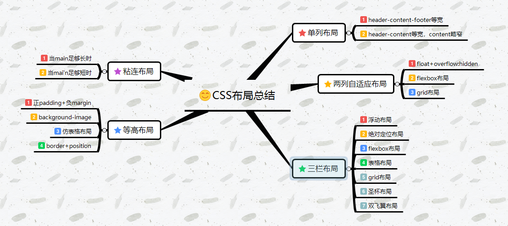

## demo效果页面
1. [单列布局1](https://keekuun.github.io/relearn-the-front-end.github.io/css3/CSS%E5%B8%83%E5%B1%80%E6%80%BB%E7%BB%93/demo/%E5%8D%95%E5%88%97%E5%B8%83%E5%B1%801.html)
2. [单列布局2](https://keekuun.github.io/relearn-the-front-end.github.io/css3/CSS%E5%B8%83%E5%B1%80%E6%80%BB%E7%BB%93/demo/%E5%8D%95%E5%88%97%E5%B8%83%E5%B1%802.html)
3. [两列自适应布局flex](https://keekuun.github.io/relearn-the-front-end.github.io/css3/CSS%E5%B8%83%E5%B1%80%E6%80%BB%E7%BB%93/demo/%E4%B8%A4%E5%88%97%E8%87%AA%E9%80%82%E5%BA%94%E5%B8%83%E5%B1%80flex.html)
4. [两列自适应布局float](https://keekuun.github.io/relearn-the-front-end.github.io/css3/CSS%E5%B8%83%E5%B1%80%E6%80%BB%E7%BB%93/demo/%E4%B8%A4%E5%88%97%E8%87%AA%E9%80%82%E5%BA%94%E5%B8%83%E5%B1%80float.html)
5. [两列自适应布局grid](https://keekuun.github.io/relearn-the-front-end.github.io/css3/CSS%E5%B8%83%E5%B1%80%E6%80%BB%E7%BB%93/demo/%E4%B8%A4%E5%88%97%E8%87%AA%E9%80%82%E5%BA%94%E5%B8%83%E5%B1%80grid.html)
6. [三栏布局：圣杯布局](https://keekuun.github.io/relearn-the-front-end.github.io/css3/CSS%E5%B8%83%E5%B1%80%E6%80%BB%E7%BB%93/demo/%E4%B8%89%E6%A0%8F%E5%B8%83%E5%B1%80%EF%BC%9A%E5%9C%A3%E6%9D%AF%E5%B8%83%E5%B1%80.html)
7. [三栏布局：双飞翼布局](https://keekuun.github.io/relearn-the-front-end.github.io/css3/CSS%E5%B8%83%E5%B1%80%E6%80%BB%E7%BB%93/demo/%E4%B8%89%E6%A0%8F%E5%B8%83%E5%B1%80%EF%BC%9A%E5%8F%8C%E9%A3%9E%E7%BF%BC%E5%B8%83%E5%B1%80.html)
8. [三栏布局：absolute](https://keekuun.github.io/relearn-the-front-end.github.io/css3/CSS%E5%B8%83%E5%B1%80%E6%80%BB%E7%BB%93/demo/%E4%B8%89%E6%A0%8F%E5%B8%83%E5%B1%80absolute.html)
9. [三栏布局：flex](https://keekuun.github.io/relearn-the-front-end.github.io/css3/CSS%E5%B8%83%E5%B1%80%E6%80%BB%E7%BB%93/demo/%E4%B8%89%E6%A0%8F%E5%B8%83%E5%B1%80flex.html)
10. [三栏布局：float](https://keekuun.github.io/relearn-the-front-end.github.io/css3/CSS%E5%B8%83%E5%B1%80%E6%80%BB%E7%BB%93/demo/%E4%B8%89%E6%A0%8F%E5%B8%83%E5%B1%80float.html)
11. [三栏布局：grid](https://keekuun.github.io/relearn-the-front-end.github.io/css3/CSS%E5%B8%83%E5%B1%80%E6%80%BB%E7%BB%93/demo/%E4%B8%89%E6%A0%8F%E5%B8%83%E5%B1%80grid.html)
12. [三栏布局：table](https://keekuun.github.io/relearn-the-front-end.github.io/css3/CSS%E5%B8%83%E5%B1%80%E6%80%BB%E7%BB%93/demo/%E4%B8%89%E6%A0%8F%E5%B8%83%E5%B1%80table.html)
13. [等高布局：border+position](https://keekuun.github.io/relearn-the-front-end.github.io/css3/CSS%E5%B8%83%E5%B1%80%E6%80%BB%E7%BB%93/demo/%E7%AD%89%E9%AB%98%E5%B8%83%E5%B1%80%EF%BC%9A%E4%BD%BF%E7%94%A8border%E5%92%8Cposition.html)
14. [等高布局：padding+margin](https://keekuun.github.io/relearn-the-front-end.github.io/css3/CSS%E5%B8%83%E5%B1%80%E6%80%BB%E7%BB%93/demo/%E7%AD%89%E9%AB%98%E5%B8%83%E5%B1%80padding%EF%BC%8Cmargin.html)
15. [等高布局：仿table](https://keekuun.github.io/relearn-the-front-end.github.io/css3/CSS%E5%B8%83%E5%B1%80%E6%80%BB%E7%BB%93/demo/%E7%AD%89%E9%AB%98%E5%B8%83%E5%B1%80%E4%BB%BFtable.html)
16. [粘连布局](https://keekuun.github.io/relearn-the-front-end.github.io/css3/CSS%E5%B8%83%E5%B1%80%E6%80%BB%E7%BB%93/demo/%E7%B2%98%E8%BF%9E%E5%B8%83%E5%B1%80.html)


## 一、单列布局
### 1、单列布局：header-content-footer等宽

原理：将header-content-footer统一设置相等的width属性（屏幕小于属性值时会出现滚动条），或者max-width属性（屏幕小于属性值时不会出现滚动条），然后设置margin: 0 auto实现居中效果

效果：

代码：
```angular2html
<!DOCTYPE html>
<html lang="en">
<head>
	<meta charset="UTF-8">
	<meta name="viewport" content="width=device-width, initial-scale=1.0">
	<meta http-equiv="X-UA-Compatible" content="ie=edge">
	<title>header-content-footer等宽的单列布局</title>
	<style>
		.wrap .header {
			height: 64px;
			max-width: 960px;
			background-color: skyblue;
			margin: 0 auto;

			line-height: 64px;
			text-align: center;
		}

		.wrap .content {
			height: 500px;
			max-width: 960px;
			background-color: #f60;
			margin: 0 auto;

			line-height: 500px;
			text-align: center;
		}

		.wrap .footer {
			height: 64px;
			max-width: 960px;
			background-color: #66595e;
			margin: 0 auto;

			line-height: 64px;
			text-align: center;
		}
	</style>
</head>
<body>
<div class="wrap">
	<div class="header">头上一片青天</div>
	<div class="content">心中一份挂念</div>
	<div class="footer">敢问路在何方</div>
</div>
</body>
</html>
```

### 2、单列布局：header-footer等宽,content略窄的单列布局 

原理：header-footer内容宽度可以不设置，利用块级元素充满整个屏幕，但是header-conter-footer的内容区设置等width,并用margin:0 auto实现居中。

效果：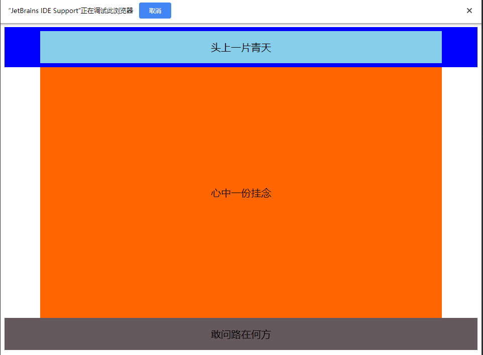

代码：
```angular2html
<!DOCTYPE html>
<html lang="en">
<head>
	<meta charset="UTF-8">
	<meta name="viewport" content="width=device-width, initial-scale=1.0">
	<meta http-equiv="X-UA-Compatible" content="ie=edge">
	<title>header-footer等宽，content窄的单列布局</title>
	<style>
		.wrap .header {
			height: 80px;
			max-width: 960px;
			background-color: blue;
			position: relative;
		}

		.wrap .header .nav {
			height: 64px;
			max-width: 800px;
			background-color: skyblue;

			line-height: 64px;
			margin: auto;
			text-align: center;
			position: absolute;
			top: 0;
			right: 0;
			bottom: 0;
			left: 0;
		}

		.wrap .content {
			height: 500px;
			max-width: 800px;
			background-color: #f60;
			margin: 0 auto;

			line-height: 500px;
			text-align: center;
		}

		.wrap .footer {
			height: 64px;
			max-width: 960px;
			background-color: #66595e;
			margin: 0 auto;

			line-height: 64px;
			text-align: center;
		}
	</style>
</head>
<body>
<div class="wrap">
	<div class="header">
		<div class="nav">头上一片青天</div>
	</div>
	<div class="content">心中一份挂念</div>
	<div class="footer">敢问路在何方</div>
</div>
</body>
</html>
```

## 二、两列自适应布局
两列自适应布局是指一列由内容撑开，另一列撑满剩余宽度的布局方式

### 1、两列自适应布局：float + overflow:hidden
    - 普通两列布局：float + margin
    - 自适应的两列布局：float + overflow:hidden
> 自适应的两列布局，通过overflow触发BFC，BFC不会重叠浮动元素。由于设置overflow:hidden并不会触发IE6-浏览器的haslayout属性，所以需要设置zoom:1来兼容IE6-浏览器。

效果：
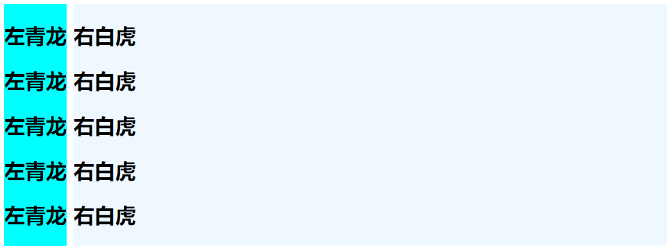
```angular2html
<!DOCTYPE html>
<html lang="en">
<head>
	<meta charset="UTF-8">
	<meta name="viewport" content="width=device-width, initial-scale=1.0">
	<meta http-equiv="X-UA-Compatible" content="ie=edge">
	<title>两列自适应布局:float+overflow:hidden </title>
	<style>
		.wrap {
			overflow: hidden;
		}

		.left {
			background-color: cyan;
			margin-right: 10px;
			float: left;
		}

		.right {
			background-color: aliceblue;
			margin-left: 10px;

			overflow: hidden;
		}
	</style>
</head>
<body>
<div class="wrap">
	<div class="left">
		<h2>左青龙</h2>
		<h2>左青龙</h2>
		<h2>左青龙</h2>
		<h2>左青龙</h2>
		<h2>左青龙</h2>
	</div>
	<div class="right">
		<h2>右白虎</h2>
		<h2>右白虎</h2>
		<h2>右白虎</h2>
		<h2>右白虎</h2>
		<h2>右白虎</h2>
	</div>
</div>
</body>
</html>
```

### 2、两列自适应布局：flex布局
Flex布局，也叫弹性盒子布局。

效果：

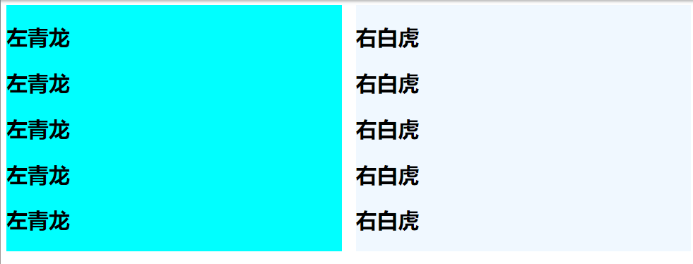

```angular2html
<!DOCTYPE html>
<html lang="en">
<head>
	<meta charset="UTF-8">
	<meta name="viewport" content="width=device-width, initial-scale=1.0">
	<meta http-equiv="X-UA-Compatible" content="ie=edge">
	<title>两列自适应布局:flex</title>
	<style>
		.wrap {
			display: flex;
		}

		.left {
			background-color: cyan;
			margin-right: 10px;
			
			flex: 1; // 去掉则左边为自适应大小
		}

		.right {
			background-color: aliceblue;
			margin-left: 10px;

			flex: 1;
		}
	</style>
</head>
<body>
<div class="wrap">
	<div class="left">
		<h2>左青龙</h2>
		<h2>左青龙</h2>
		<h2>左青龙</h2>
		<h2>左青龙</h2>
		<h2>左青龙</h2>
	</div>
	<div class="right">
		<h2>右白虎</h2>
		<h2>右白虎</h2>
		<h2>右白虎</h2>
		<h2>右白虎</h2>
		<h2>右白虎</h2>
	</div>
</div>
</body>
</html>
```

### 3、两列自适应布局：grid布局
Grid布局，基于网格的二维布局系统，用来优化用户界面设计。

效果：

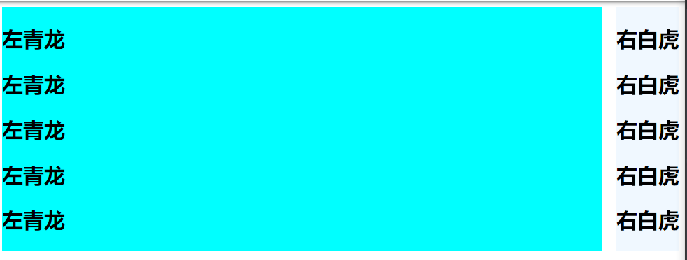

```angular2html
<!DOCTYPE html>
<html lang="en">
<head>
	<meta charset="UTF-8">
	<meta name="viewport" content="width=device-width, initial-scale=1.0">
	<meta http-equiv="X-UA-Compatible" content="ie=edge">
	<title>两列自适应布局:grid</title>
	<style>
		.wrap {
			display: grid;
			grid-gap: 20px;
			/*grid-template-columns: auto 1fr; // 左自适应+右铺满*/
			grid-template-columns: 1fr auto; // 右自适应+左铺满
		}

		.left {
			background-color: cyan;
		}

		.right {
			background-color: aliceblue;
		}
	</style>
</head>
<body>
<div class="wrap">
	<div class="left">
		<h2>左青龙</h2>
		<h2>左青龙</h2>
		<h2>左青龙</h2>
		<h2>左青龙</h2>
		<h2>左青龙</h2>
	</div>
	<div class="right">
		<h2>右白虎</h2>
		<h2>右白虎</h2>
		<h2>右白虎</h2>
		<h2>右白虎</h2>
		<h2>右白虎</h2>
	</div>
</div>
</body>
</html>
```

## 三、三栏布局
特征：中间列自适应宽度，旁边两侧固定宽度

案例：高度已知，其中左栏、右栏宽度各为200px,中间自适应，

### 1、浮动布局
原理：左边栏float:left， 右边栏float: right， 中间不管。

效果：


```angular2html
<!DOCTYPE html>
<html lang="en">
<head>
	<meta charset="UTF-8">
	<meta name="viewport" content="width=device-width, initial-scale=1.0">
	<meta http-equiv="X-UA-Compatible" content="ie=edge">
	<title>三栏布局：float布局</title>
	<style>
		* {
			margin: 0;
		}
		aside.left {
			background-color: seagreen;
			float: left;
			width: 200px;
		}

		aside.right {
			background-color: whitesmoke;
			float: right;
			width: 200px;
		}

		article.center {
			background-color: bisque;
		}
	</style>
</head>
<body>
<main>
	<aside class="left">
		<h2>左青龙</h2>
		<h2>左青龙</h2>
		<h2>左青龙</h2>
		<h2>左青龙</h2>
		<h2>左青龙</h2>
	</aside>
	<!-- 右栏部分要写在中间内容之前-->
	<!-- 右栏部分要写在中间内容之前-->
	<!-- 右栏部分要写在中间内容之前-->
	<aside class="right">
		<h2>右白虎</h2>
		<h2>右白虎</h2>
		<h2>右白虎</h2>
		<h2>右白虎</h2>
		<h2>右白虎</h2>
	</aside>

	<article class="center">
		<h2>中间住着二百五</h2>
		<h2>中间住着二百五</h2>
		<h2>中间住着二百五</h2>
		<h2>中间住着二百五</h2>
		<h2>中间住着二百五</h2>
	</article>

</main>
</body>
</html>
```
>浮动布局，DOM结构必须先写浮动部分，然后中间块，否则有浮动会调到下一行。
>浮动布局的优点：简单，兼容性好
>浮动布局的缺点：浮动布局脱离文档流，需要清除浮动，否则会带来问题，比如：父容器高度塌陷等。

### 2、绝对定位布局
原理：left-center-right均绝对定位，然后设置中间栏的left和right属性为左右留出空间。

效果：

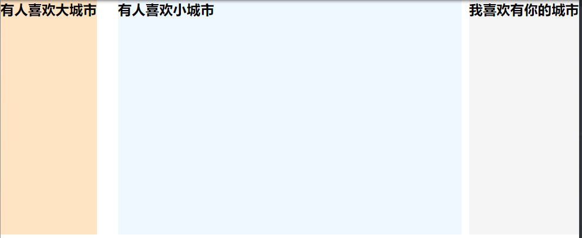

```angular2html
<!DOCTYPE html>
<html lang="en">
<head>
	<meta charset="UTF-8">
	<meta name="viewport" content="width=device-width, initial-scale=1.0">
	<meta http-equiv="X-UA-Compatible" content="ie=edge">
	<title>三栏布局：绝对定位布局</title>
	<style>
		* {
			margin: 0;
		}
		.left,.center,.right{
			position: absolute;
			height: 400px;
		}
		aside.left {
			background-color: bisque;
			left: 0;
		}

		article.center {
			background-color: aliceblue;
			left: 200px;
			right: 200px;
		}

		aside.right {
			background-color: whitesmoke;
			right: 0;
		}
	</style>
</head>
<body>
<main class="wrap">
	<aside class="left">
		<h3>有人喜欢大城市</h3>
	</aside>
	<article class="center">
		<h3>有人喜欢小城市</h3>
	</article>
	<aside class="right">
		<h3>我喜欢有你的城市</h3>
	</aside>
</main>
</body>
</html>
```
>绝对定位布局，优点：方便快捷，问题少
>缺点：容器脱离文档流，后代元素也脱离文档流，高度位置的时候，有问题，故该法有效性和可用性比较差。

### 3、flex布局
原理：直接设置父容器display:flex

效果：

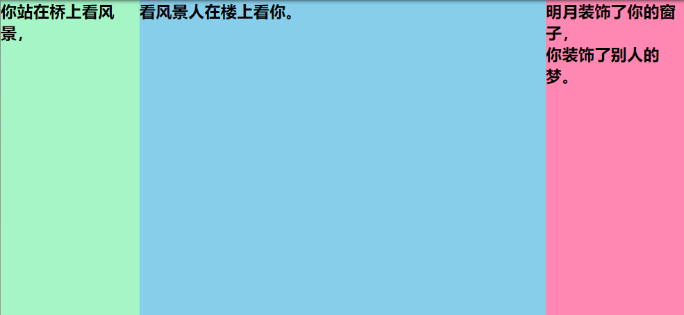

```angular2html
<!DOCTYPE html>
<html lang="en">
<head>
	<meta charset="UTF-8">
	<meta name="viewport" content="width=device-width, initial-scale=1.0">
	<meta http-equiv="X-UA-Compatible" content="ie=edge">
	<title>三栏布局：flex布局</title>
	<style>
		*{
			margin: 0;
		}
		main.wrap{
			display: flex;
		}
		.left,.center,.right{
			height: 500px;
		}
		aside.left{
			background-color: #a5f5c7;
			width: 200px;
		}
		article.center{
			background-color: skyblue;
			flex: 1;
		}
		aside.right{
			background-color: #ff88b2;
			width: 200px;
		}
	</style>
</head>
<body>
<main class="wrap">
	<aside class="left">
		<h3>你站在桥上看风景，</h3>
	</aside>
	<article class="center">
		<h3>看风景人在楼上看你。</h3>
	</article>
	<aside class="right">
		<h3>明月装饰了你的窗子，</h3>
		<h3>你装饰了别人的梦。</h3>
	</aside>
</main>
</body>
</html>
```
>flex布局为了解决上述两种方式的不足出现的，是比较完美的一个。目前移动端的布局也都是用flex。 flex的缺点就是IE10开始支持，但是IE10的是-ms形式的。
### 4、表格布局
原理：直接设置父容器display:table,子容器display:table-cell

效果：


```angular2html
<!DOCTYPE html>
<html lang="en">
<head>
	<meta charset="UTF-8">
	<meta name="viewport" content="width=device-width, initial-scale=1.0">
	<meta http-equiv="X-UA-Compatible" content="ie=edge">
	<title>三栏布局：table布局</title>
	<style>
		*{
			margin: 0;
		}
		main.wrap{
			display: table;
			width: 100%;
		}
		.left,.center,.right{
			height: 500px;
			display: table-cell;
		}
		aside.left{
			background-color: #a5f5c7;
			width: 200px;
		}
		article.center{
			background-color: skyblue;
		}
		aside.right{
			background-color: #ff88b2;
			width: 200px;
		}
	</style>
</head>
<body>
<main class="wrap">
	<aside class="left">
		<h3>我还是很喜欢你，</h3>
	</aside>
	<article class="center">
		<h3>像风走了八千里，</h3>
	</article>
	<aside class="right">
		<h3>不问归期。</h3>
	</aside>
</main>
</body>
</html>
```
> 表格布局的优点：兼容性很好，在flex布局不兼容的时候，推荐用表格布局。有个特点，当内容溢出时会自动撑开父容器。
>缺点：1、无法设置栏边距 2、对SEO不友好 3、当其中一个单元格超出高度时，另外两个栏也会跟着变高。

### 5、grid布局
原理：直接设置父容器display:grid

效果：

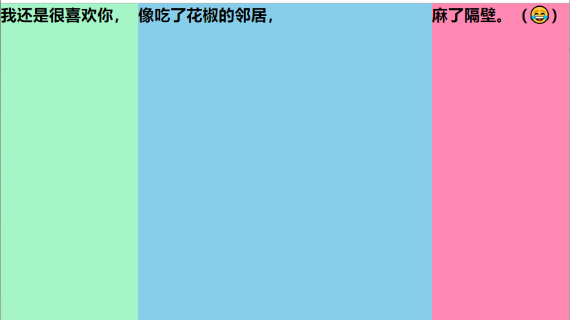

```angular2html
<!DOCTYPE html>
<html lang="en">
<head>
	<meta charset="UTF-8">
	<meta name="viewport" content="width=device-width, initial-scale=1.0">
	<meta http-equiv="X-UA-Compatible" content="ie=edge">
	<title>三栏布局：grid布局</title>
	<style>
		*{
			margin: 0;
		}
		main.wrap{
			display: grid;
			grid-template-columns: 200px auto 200px;
			grid-template-rows: 500px;
		}
		.left,.center,.right{
			/*height: 500px;*/
		}
		aside.left{
			background-color: #a5f5c7;
		}
		article.center{
			background-color: skyblue;
		}
		aside.right{
			background-color: #ff88b2;
		}
	</style>
</head>
<body>
<main class="wrap">
	<aside class="left">
		<h3>我还是很喜欢你，</h3>
	</aside>
	<article class="center">
		<h3>像吃了花椒的邻居，</h3>
	</article>
	<aside class="right">
		<h3>麻了隔壁。（😂）</h3>
	</aside>
</main>
</body>
</html>
```
>优点：CSS Grid是创建网格布局最强大和最简单的工具。就像表格一样，网格布局可以让Web设计师根据元素按列或行对齐排列，但他和表格不同，网格布局没有内容结构，从而使各种布局不可能与表格一样。例如，一个网格布局中的子元素都可以定位自己的位置，这样他们可以重叠和类似元素定位。
>缺点：兼容性不好。IE10+上支持，而且也仅支持部分属性。

### 6、圣杯布局
特点：比较特殊的三栏布局，同样也是两边固定宽度，中间自适应，唯一区别是dom结构必须是先写中间列部分，这样实现中间列可以优先加载。

原理解读：

+ 1.全部设置`float: left`,center设置width:100%自适应，left和right设置width:200px固定尺寸。此时，left和right部分会跳到下一行

```angular2html
<style>
		* {
			margin: 0;
		}
		.left, .center, .right {
			height: 200px;
			/*全部float：left*/
			float: left;
		}

		article.center {
			background-color: skyblue;
			width: 100%;
			height: 300px;
		}

		aside.left {
			background-color: #a5f5c7;
			width: 200px;
		}

		aside.right {
			background-color: #ff88b2;
			width: 200px;
		}
	</style>
```
+ 2.再设置左右的margin为负值，让左右部分与中间处于同一行。此时，左右会浮在中间上方，覆盖中间部分。
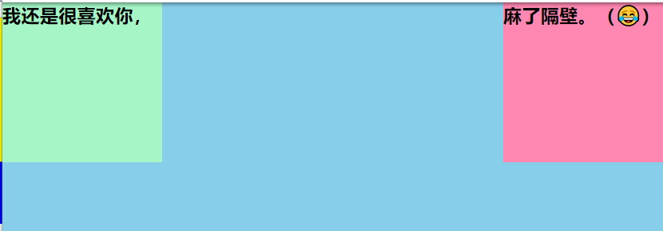
```angular2html
<style>
		* {
			margin: 0;
		}
		.left, .center, .right {
			height: 200px;
			/*全部float：left*/
			float: left;
		}

		article.center {
			background-color: skyblue;
			width: 100%;
		}

		aside.left {
			background-color: #a5f5c7;
			width: 200px;
			
			margin-left: -100%;
		}

		aside.right {
			background-color: #ff88b2;
			width: 200px;
			
			margin-left: -200px;
		}
	</style>
```
+ 3.再设置中间的padding-left和padding-right为左右预留空间。
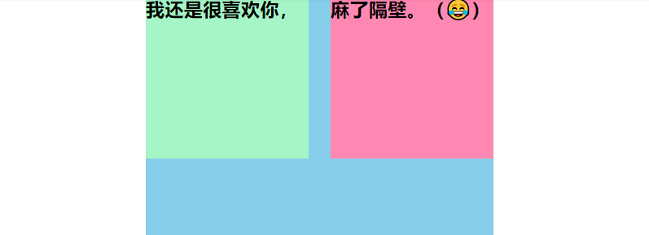
```angular2html
<style>
		* {
			margin: 0;
		}
        main.wrap {
            /*给左右栏预留空间*/
            padding-left: 200px;
            padding-right: 200px;
        }
		.left, .center, .right {
			height: 200px;
			/*全部float：left*/
			float: left;
		}

		article.center {
			background-color: skyblue;
			width: 100%;
		}

		aside.left {
			background-color: #a5f5c7;
			width: 200px;
			
			margin-left: -100%;
		}

		aside.right {
			background-color: #ff88b2;
			width: 200px;
			
			margin-left: -200px;
		}
	</style>
```
+ 4.最后，将左右移动到预留空间的位置处。

```angular2html
<style>
		* {
			margin: 0;
		}

		main.wrap {
			/*给左右栏预留空间*/
			padding-left: 200px;
			padding-right: 200px;
		}

		.left, .center, .right {
			height: 200px;
			/*全部float：left*/
			float: left;
		}

		article.center {
			background-color: skyblue;
			width: 100%;
			/*height: 300px;*/
		}

		aside.left {
			background-color: #a5f5c7;
			width: 200px;
			margin-left: -100%;
			position: relative;
			left: -200px;
		}

		aside.right {
			background-color: #ff88b2;
			width: 200px;
			margin-left: -200px;
			position: relative;
			right: -200px;
		}
	</style>
```

完整代码如下：

```angular2html
<!DOCTYPE html>
<html lang="en">
<head>
	<meta charset="UTF-8">
	<meta name="viewport" content="width=device-width, initial-scale=1.0">
	<meta http-equiv="X-UA-Compatible" content="ie=edge">
	<title>三栏布局：圣杯布局</title>
	<style>
		* {
			margin: 0;
		}

		main.wrap {
			/*给左右栏预留空间*/
			padding-left: 200px;
			padding-right: 200px;
		}

		.left, .center, .right {
			height: 200px;
			/*全部float：left*/
			float: left;
		}

		article.center {
			background-color: skyblue;
			width: 100%;
			/*height: 300px;*/
		}

		aside.left {
			background-color: #a5f5c7;
			width: 200px;
			margin-left: -100%;
			position: relative;
			left: -200px;
		}

		aside.right {
			background-color: #ff88b2;
			width: 200px;
			margin-left: -200px;
			position: relative;
			right: -200px;
		}
	</style>
</head>
<body>
<main class="wrap">
	<!--先先写中间部分-->
	<!--先先写中间部分-->
	<!--先先写中间部分-->
	<article class="center">
		<h3>像吃了花椒的邻居，</h3>
	</article>

	<aside class="left">
		<h3>我还是很喜欢你，</h3>
	</aside>

	<aside class="right">
		<h3>麻了隔壁。（😂）</h3>
	</aside>
</main>
</body>
</html>
```

> 圣杯布局的缺点：center部分的最小宽度不能小于left部分的宽度，否则会left部分掉到下一行
如果其中一列内容高度拉长，其他两列的背景并不会自动填充。(借助等高布局正padding+负margin可解决，下文会介绍)
### 7、双飞翼布局
特点：同样也是三栏布局，在圣杯布局基础上进一步优化，解决了圣杯布局错乱问题，实现了内容与布局的分离。而且任何一栏都可以是最高栏，不会出问题。

原理解读(前两步与圣杯布局一样)：
+ 1.三个部分都设定为左浮动，然后设置center的宽度为100%，此时，left和right部分会跳到下一行；
+ 2.通过设置margin-left为负值让left和right部分回到与center部分同一行；
+ 3.center部分增加一个内层div，并设margin: 0 200px（左右的宽度）；

效果：

```angular2html
<!DOCTYPE html>
<html lang="en">
<head>
	<meta charset="UTF-8">
	<meta name="viewport" content="width=device-width, initial-scale=1.0">
	<meta http-equiv="X-UA-Compatible" content="ie=edge">
	<title>三栏布局：双飞翼布局</title>
	<style>
		* {
			margin: 0;
		}

		main.wrap {
		/*确保中间内容可以显示出来，2*left宽+right宽*/
			min-width: 600px;
		}

		.left, .center, .right {
			height: 200px;
			/*全部float：left*/
			float: left;
		}

		article.center {
			background-color: skyblue;
			width: 100%;
			height: 500px;
		}
		article.center .inner{
		/*新增部分*/
			margin: 0 200px;
		}
		aside.left {
			background-color: #a5f5c7;
			width: 200px;
			height: 400px;
			margin-left: -100%;
		}

		aside.right {
			background-color: #ff88b2;
			width: 200px;
			height: 400px;
			margin-left: -200px;
		}
	</style>
</head>
<body>
<main class="wrap">
	<!--先写中间部分-->
	<!--先写中间部分-->
	<!--先写中间部分-->
	<article class="center">
		<div class="inner">
			<h3>像吃了花椒的邻居，</h3>
		</div>
	</article>

	<aside class="left">
		<h3>我还是很喜欢你，</h3>
	</aside>

	<aside class="right">
		<h3>麻了隔壁。（😂）</h3>
	</aside>
</main>
</body>
</html>
```
>双飞翼布局缺点：多加一层 dom 树节点，增加渲染树生成的计算量。

#### 圣杯布局 vs 双飞翼布局:
- 两种布局方式都是把**主列放在文档流最前面**，使**主列优先加载**。
- 两种布局方式在实现上也有相同之处，都是让**三列浮动**，然后通过**左右负外边距**形成三列布局。
- 两种布局方式的不同之处在于如何处理中间主列的位置：
- **圣杯布局**是利用**父容器的左、右内边距+两个从列相对定位**；
- **双飞翼布局**是把主列嵌套在一个**新的父级块中利用主列的左、右外边距**进行布局调整

##四、等高布局
等高布局是指子元素在父元素中高度相等的布局方式。接下来我们介绍常见几种实现方式：

###1、利用正padding+负margin
原理：
在圣杯布局基础上，**设置一个大数值的 padding-bottom，再设置相同数值的负的 margin-bottom，并在所有列外面加上一个容器，并设置 overflow:hidden 把溢出背景切掉。**解决圣杯布局的第二个缺点。

新增代码如下：
```angular2html
  .center,
  .left,
  .right {
    padding-bottom: 10000px;
    margin-bottom: -10000px;
  }
  .wrap {
    <!--把溢出背景切掉-->
    overflow: hidden;
}
```
```angular2html
<!DOCTYPE html>
<html lang="en">
<head>
	<meta charset="UTF-8">
	<meta name="viewport" content="width=device-width, initial-scale=1.0">
	<meta http-equiv="X-UA-Compatible" content="ie=edge">
	<title>三栏布局：等高布局（利用正padding+负margin）</title>
	<style>
		* {
			margin: 0;
		}

		main.wrap {
			/*给左右栏预留空间*/
			padding-left: 200px;
			padding-right: 200px;

			/*新增代码*/
			overflow: hidden;
		}

		.left, .center, .right {
			height: 200px;
			/*全部float：left*/
			float: left;

			/*新增代码*/
			padding-bottom: 10000px;
			margin-bottom: -10000px;
		}

		article.center {
			background-color: skyblue;
			width: 100%;
			height: 300px;
		}

		aside.left {
			background-color: #a5f5c7;
			width: 200px;
			margin-left: -100%;
			position: relative;
			left: -200px;
		}

		aside.right {
			background-color: #ff88b2;
			width: 200px;
			margin-left: -200px;
			position: relative;
			right: -200px;
		}
	</style>
</head>
<body>
<main class="wrap">
	<!--先先写中间部分-->
	<!--先先写中间部分-->
	<!--先先写中间部分-->
	<article class="center">
		<h3>像吃了花椒的邻居，</h3>
	</article>

	<aside class="left">
		<h3>我还是很喜欢你，</h3>
	</aside>

	<aside class="right">
		<h3>麻了隔壁。（😂）</h3>
	</aside>
</main>
</body>
</html>
```

###2、利用背景图片（不可取）
原理：这是实现等高列最早使用的一种方法，就是使用背景图片，在列的父元素上使用这个背景图进行Y轴的铺放，从而实现一种等高列的假象。实现方法简单，兼容性强，不需要太多的css样式就可以轻松实现,但此方法不适合流体布局等高列的布局。
但是需要一张背景图片，例如：

```angular2html
<!DOCTYPE html>
<html lang="en">
<head>
	<meta charset="UTF-8">
	<meta name="viewport" content="width=device-width, initial-scale=1.0">
	<meta http-equiv="X-UA-Compatible" content="ie=edge">
	<title>三栏布局：等高布局（利用bg img）</title>
	<style>
		* {
			margin: 0;
		}

		main.wrap {
			/*注意img必须足够宽*/
			background: url("../img/bg.png") repeat-y;
			width: 100%;
			height: 500px;
			margin: 0 auto;
		}

		.left, .center, .right {
			float: left;
		}

		article.center {
			/*background-color: skyblue;*/
			width: calc(100% - 200px - 200px);
		}

		aside.left {
			/*background-color: #a5f5c7;*/
			width: 200px;
		}

		aside.right {
			/*background-color: #ff88b2;*/
			width: 200px;
		}
	</style>
</head>
<body>
<main class="wrap clearfix">
	<aside class="left">
		<h3>我还是很喜欢你，</h3>
	</aside>

	<article class="center">
		<h3>像吃了花椒的邻居，</h3>
	</article>

	<aside class="right">
		<h3>麻了隔壁。（😂）</h3>
	</aside>
</main>
</body>
</html>
```
###3、模仿表格布局
这是一种非常简单，易于实现的方法。不过兼容性不好，在ie6-7无法正常运行。

效果：

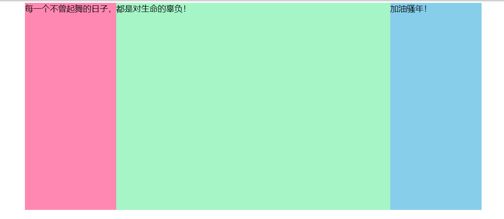

```angular2html
<!DOCTYPE html>
<html lang="en">
<head>
	<meta charset="UTF-8">
	<meta name="viewport" content="width=device-width, initial-scale=1.0">
	<meta http-equiv="X-UA-Compatible" content="ie=edge">
	<title>三栏布局：等高布局（仿table）</title>
	<style>
		.table{
			display: table;
			width: auto;
			min-width: 1000px;
			margin: 0 auto;
			height: 500px;
		}
		.table-row{
			display: table-row;
		}
		.table-cell{
			display: table-cell;
			height: 100%;
		}

		.cel-left{
			background: #ff88b2;
			width: 20%;
		}
		.cel-center{
			background: #a5f5c7;
			width: 60%;
		}
		.cel-right{
			background: skyblue;
			width: 20%;
		}
	</style>
</head>
<body>
<div class="table">
	<div class="table-row">
		<div class="table-cell cel-left">
			<div class="left">每一个不曾起舞的日子，</div>
		</div>
		<div class="table-cell cel-center">
			<div class="center">都是对生命的辜负！</div>
		</div>
		<div class="table-cell cel-right">
			<div class="right">加油骚年！</div>
		</div>
	</div>
</div>
</body>
</html>
```

###4、使用border和positon
使用边框和绝对定位来实现一个假的高度相等列的效果。结构简单，兼容各浏览器，容易掌握。假设你需要实现一个两列等高布局，侧栏高度要和主内容高度相等。

效果：


````angular2html
<!DOCTYPE html>
<html lang="en">
<head>
	<meta charset="UTF-8">
	<meta name="viewport" content="width=device-width, initial-scale=1.0">
	<meta http-equiv="X-UA-Compatible" content="ie=edge">
	<title>三栏布局：等高布局（border+position）</title>
	<style>
		.wrap{
			width: 1200px;
			margin: 0 auto;
		}
		.left{
			background: #50c5f5;
			position: absolute;
			width: 200px;
			height:500px;
		}
		.center{
			background: #ff6600;
			border-right: 200px solid #50c5f5;
			border-left: 200px solid #f5cabb;
			position: absolute;
			width: 800px;
			height: 500px;
		}
		.right{
			background: #f5cabb;
			position: absolute;
			width: 200px;
			height:500px;
		}
	</style>
</head>
<body>
<div class="wrap">
	<div class="left"></div>
	<div class="center"></div>
	<div class="right"></div>
</div>
</body>
</html>
````

##五、粘连布局
+ 1、特点：
    + 有一块内容<main>，当<main>的高康足够长的时候，紧跟在<main>后面的元素<footer>会跟在<main>元素的后面。
    + 当<main>元素比较短的时候(比如小于屏幕的高度),我们期望这个<footer>元素能够“粘连”在屏幕的底部

+ 2、实现步骤：
    + (1)footer必须是一个独立的结构，与wrap没有任何嵌套关系
    + (2)wrap区域的高度通过设置min-height，变为视口高度
    + (3)footer要使用margin为负来确定自己的位置
    + (4)在main区域需要设置 padding-bottom。这也是为了防止负 margin 导致 footer 覆盖任何实际内容。

效果：

<main>不够长的时候：

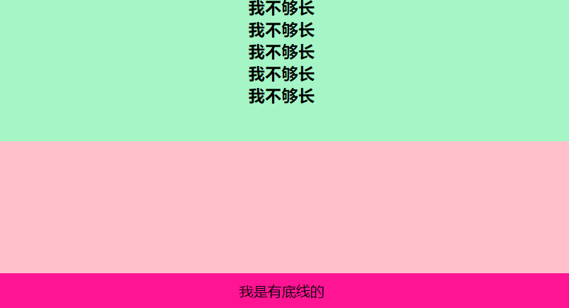

<main>足够长的时候：

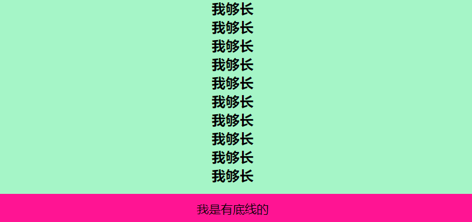
```angular2html
<!DOCTYPE html>
<html lang="en">
<head>
	<meta charset="UTF-8">
	<meta name="viewport" content="width=device-width, initial-scale=1.0">
	<meta http-equiv="X-UA-Compatible" content="ie=edge">
	<title>粘连布局（main足够长）</title>
	<style>
		*{
			margin: 0;
			padding: 0;
		}
		html,body{
			/*高度一层层继承下来*/
			height: 100%;
		}
		.wrap{
			min-height: 100%;
			background: pink;
			text-align: center;
			overflow: hidden;
		}
		.wrap .main {
			padding-bottom: 50px;
			background: #a5f5c7;
		}
		.footer {
			height: 50px;
			line-height: 50px;
			background: deeppink;
			text-align: center;
			margin-top: -50px;
		}
	</style>
</head>
<body>
<div class="wrap">
	<div class="main">
		<h3>我不够长</h3>
		<h3>我不够长</h3>
		<h3>我不够长</h3>
		<h3>我不够长</h3>
		<h3>我不够长</h3>
	</div>
</div>

<div class="footer">我是有底线的</div>
</body>
</html>
```
##参考文章
- [双飞翼布局介绍-始于淘宝UED](http://www.imooc.com/wenda/detail/254035)
- [CSS三栏布局的四种方法](https://zhuanlan.zhihu.com/p/24305930)
- [CSS 两列布局---左侧固定，右侧自适应](http://changfeng-liu.blog.163.com/blog/static/21046518420128645553217/)
- [两列自适应布局的四种思路](http://www.cnblogs.com/xiaohuochai/p/5454232.html)
- [css常见布局之九：三栏布局的常见实现](https://zhyjor.github.io/2018/07/16/css%E5%B8%B8%E8%A7%81%E5%B8%83%E5%B1%80%E4%B9%8B%E4%B9%9D%EF%BC%9A%E4%B8%89%E6%A0%8F%E5%B8%83%E5%B1%80%E7%9A%84%E5%B8%B8%E8%A7%81%E5%AE%9E%E7%8E%B0/)
- [【布局】聊聊为什么淘宝要提出「双飞翼」布局](https://github.com/zwwill/blog/issues/11)
- [CSS的单列布局与二&三列布局](https://blog.csdn.net/jlu16/article/details/78399458)

>参见大神的文章[浪里行舟](https://github.com/ljianshu/Blog/issues/40)
