>哎，最近项目又遇到`水平垂直居中`的需求,不做一下总结，总觉得没有level up!

## 水平居中 
### 行内元素
父元素块级元素：父元素`text-align: center`
```angular2html
<!DOCTYPE html>
<html lang="en">
<head>
	<meta charset="UTF-8">
	<meta name="viewport" content="width=device-width, initial-scale=1.0">
	<meta http-equiv="X-UA-Compatible" content="ie=edge">
	<title>水平居中：父块级</title>
	<style>
		#father{
			width: 666px;
			height: 333px;
			background-color: seagreen;
			text-align: center;
		}
	</style>
</head>
<body>
	<div id="father">
		<span id="son">我想牵着你的手，从心动到古稀！---酒馆</span>
	</div>
</body>
</html>
```
效果如下：

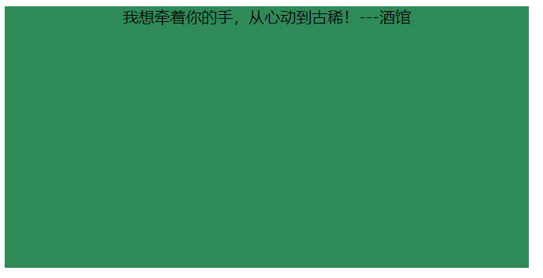
父元素不是块级元素：父元素先设置为块级元素，在设置`text-align: center`
```angular2html
<!DOCTYPE html>
<html lang="en">
<head>
	<meta charset="UTF-8">
	<meta name="viewport" content="width=device-width, initial-scale=1.0">
	<meta http-equiv="X-UA-Compatible" content="ie=edge">
	<title>水平居中：父非块级</title>
	<style>
		#father {
			width: 666px;
			height: 333px;
			background-color: seagreen;
			text-align: center;
			display: block;
		}
	</style>
</head>
<body>
<span id="father">
	<span id="son">我想牵着你的手，从心动到古稀！---酒馆</span>
</span>
</body>
</html>
```
效果如下：

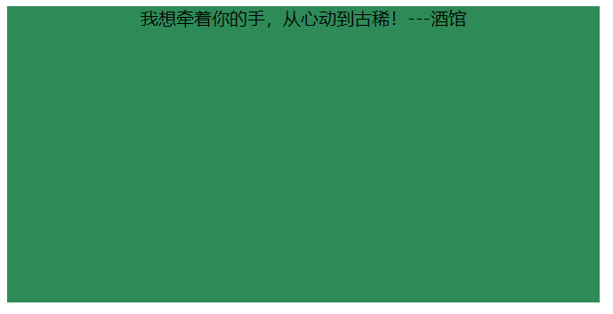
### 块级元素

#### 方案一
**定宽度**：谁居中，谁设置`margin:0 auto`
```angular2html
<!DOCTYPE html>
<html lang="en">
<head>
	<meta charset="UTF-8">
	<meta name="viewport" content="width=device-width, initial-scale=1.0">
	<meta http-equiv="X-UA-Compatible" content="ie=edge">
	<title>水平居中：块级元素-定宽</title>
	<style>
		#father{
			width: 666px;
			height: 333px;
			background-color: seagreen;
		}
		#son{
			width: 200px;
			height: 111px;
			background-color: skyblue;
			margin: 0 auto;
		}
	</style>
</head>

<body>
<div id="father">
	<div id="son">我想牵着你的手，从心动到古稀！---酒馆</div>
</div>
</body>
</html>
```
效果如下：

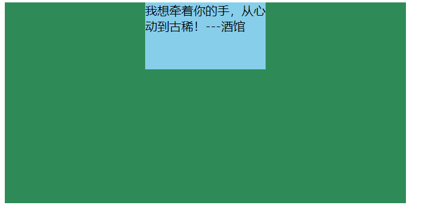
**不定宽度**：子元素设为行内或行内块元素`display:inline/inline-block`,父元素设置`text-align:center`
```angular2html
<!DOCTYPE html>
<html lang="en">
<head>
	<meta charset="UTF-8">
	<meta name="viewport" content="width=device-width, initial-scale=1.0">
	<meta http-equiv="X-UA-Compatible" content="ie=edge">
	<title>水平居中：块级元素-不定宽</title>
	<style>
		#father{
			width: 666px;
			height: 333px;
			background-color: seagreen;
			text-align: center;
		}
		#son{
			background-color: skyblue;
			display: inline;
		}
	</style>
</head>

<body>
<div id="father">
	<div id="son">我想牵着你的手，从心动到古稀！---酒馆</div>
</div>
</body>
</html>
```
效果如下：

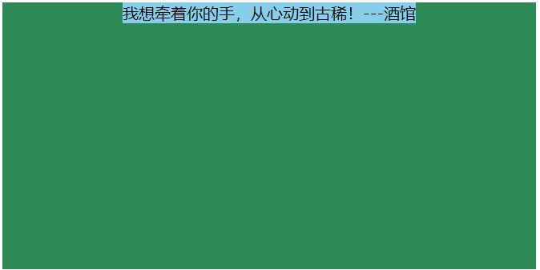
#### 方案二：使用定位属性
首先设置：
```angular2html
父元素：相对定位 `position:relative`
子元素：绝对定位`position:absolute` + `left:50%`
```
其次**定宽**的话：
```angular2html
子元素:
  margin-left:设置位元素宽度的负一半
  或者：
  transform: translateX(-50%)
```
```angular2html
<!DOCTYPE html>
<html lang="en">
<head>
	<meta charset="UTF-8">
	<meta name="viewport" content="width=device-width, initial-scale=1.0">
	<meta http-equiv="X-UA-Compatible" content="ie=edge">
	<title>水平居中：定位属性-定宽</title>
	<style>
		#father{
			width: 666px;
			height: 333px;
			background-color: seagreen;

			position: relative;
		}
		#son{
			width: 200px;
			height: 111px;
			background-color: skyblue;
			position: absolute;
			left: 50%;
			-webkit-transform: translateX(-50%);
			-moz-transform: translateX(-50%);
			-ms-transform: translateX(-50%);
			-o-transform: translateX(-50%);
			transform: translateX(-50%);

			/*margin-left: -100px;*/
		}
	</style>
</head>

<body>
<div id="father">
	<div id="son">我想牵着你的手，从心动到古稀！---酒馆</div>
</div>
</body>
</html>
```
效果如下：

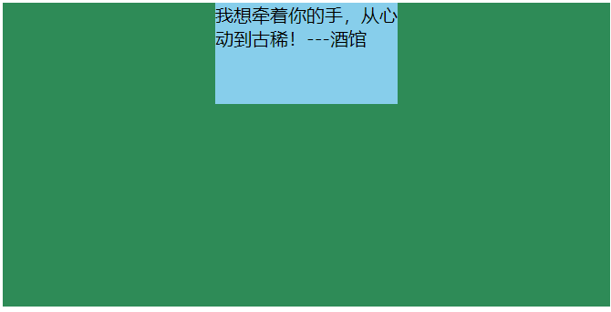
那么**不定宽**的话：只能用`transform: translateX(-50%);`
```angular2html
<!DOCTYPE html>
<html lang="en">
<head>
	<meta charset="UTF-8">
	<meta name="viewport" content="width=device-width, initial-scale=1.0">
	<meta http-equiv="X-UA-Compatible" content="ie=edge">
	<title>水平居中：定位属性-不定宽</title>
	<style>
		#father{
			width: 666px;
			height: 333px;
			background-color: seagreen;

			position: relative;
		}
		#son{
			height: 111px;
			background-color: skyblue;
			position: absolute;
			left: 50%;
			-webkit-transform: translateX(-50%);
			-moz-transform: translateX(-50%);
			-ms-transform: translateX(-50%);
			-o-transform: translateX(-50%);
			transform: translateX(-50%);

			/*此处就不适用了*/
			/*margin-left: -100px;*/
		}
	</style>
</head>

<body>
<div id="father">
	<div id="son">我想牵着你的手，从心动到古稀！---酒馆</div>
</div>
</body>
</html>
```
效果如下：

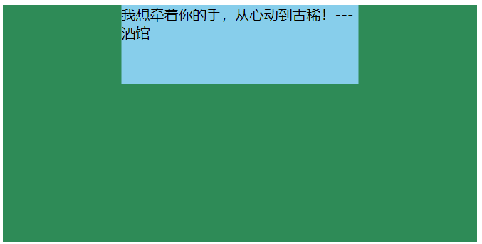
#### 方案三：使用flexbox布局实现（宽度定不定都可以）
使用flexbox布局，只需要给待处理的块状元素的父元素添加属性 `display: flex; justify-content: center;`
```angular2html
<!DOCTYPE html>
<html lang="en">
<head>
	<meta charset="UTF-8">
	<meta name="viewport" content="width=device-width, initial-scale=1.0">
	<meta http-equiv="X-UA-Compatible" content="ie=edge">
	<title>水平居中：flexbox布局（宽度不论）</title>
	<style>
		#father {
			width: 666px;
			height: 333px;
			background-color: seagreen;
			/*水平居中flexbox */
			display: flex;
			justify-content: center;
		}

		#son {
			height: 111px;
			background-color: skyblue;
		}
	</style>
</head>

<body>
<div id="father">
	<div id="son">我想牵着你的手，从心动到古稀！---酒馆</div>
</div>
</body>
</html>
```
效果如下：

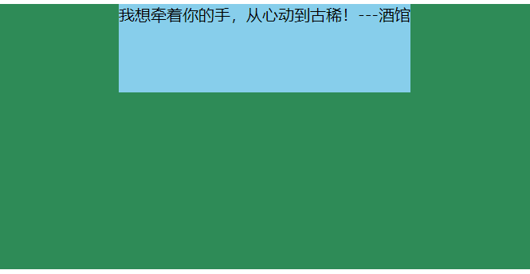
## 垂直居中

### 单行的行内元素
只需设置`单行的行内元素`的：`行高（line-height）=盒子高度`
```angular2html
<!DOCTYPE html>
<html lang="en">
<head>
	<meta charset="UTF-8">
	<meta name="viewport" content="width=device-width, initial-scale=1.0">
	<meta http-equiv="X-UA-Compatible" content="ie=edge">
	<title>垂直居中：单行的行内元素</title>
	<style>
		#father{
			width: 666px;
			height: 333px;
			background-color: seagreen;
		}
		#son{
			height: 111px;
			line-height: 333px;
			background-color: skyblue;
		}
	</style>
</head>

<body>
<div id="father">
	<span id="son">我想牵着你的手，从心动到古稀！---酒馆</span>
</div>
</body>
</html>
```
效果如下：

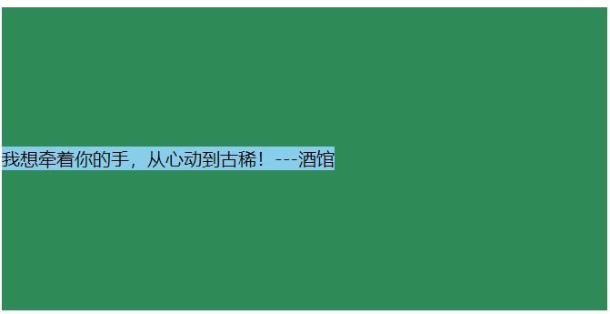
### 多行的行内元素
父元素：`display:table-cell;vertical-align:center`即可
```angular2html
<!DOCTYPE html>
<html lang="en">
<head>
	<meta charset="UTF-8">
	<meta name="viewport" content="width=device-width, initial-scale=1.0">
	<meta http-equiv="X-UA-Compatible" content="ie=edge">
	<title>垂直居中：多行的行内元素</title>
	<style>
		#father{
			width: 666px;
			height: 333px;
			background-color: seagreen;

			display: table-cell;
			vertical-align: middle;
		}
		#son{
			background-color: skyblue;
		}
	</style>
</head>

<body>
<div id="father">
	<span id="son">我想牵着你的手，从心动到古稀！我想牵着你的手，从心动到古稀！我想牵着你的手，从心动到古稀！我想牵着你的手，从心动到古稀！---酒馆</span>
</div>
</body>
</html>
```
效果如下：

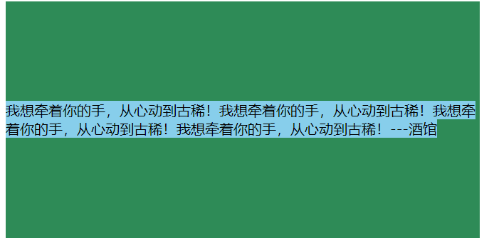 
### 块级元素
#### 方案一：使用定位
首先设置：
```angular2html
父元素：相对定位 `position:relative`
子元素：绝对定位`position:absolute` + `top:50%`
```
其次**定高**的话：
```angular2html
子元素:
  margin-top:设置位元素宽度的负一半
  或者：
  transform: translateY(-50%)
```
```angular2html
<!DOCTYPE html>
<html lang="en">
<head>
	<meta charset="UTF-8">
	<meta name="viewport" content="width=device-width, initial-scale=1.0">
	<meta http-equiv="X-UA-Compatible" content="ie=edge">
	<title>垂直居中：定位属性-定高</title>
	<style>
		#father{
			width: 666px;
			height: 333px;
			background-color: seagreen;
			position: relative;
		}
		#son{
			height: 120px;
			background-color: skyblue;
			position: absolute;
			top: 50%;
			-webkit-transform: translateY(-50%);
			-moz-transform: translateY(-50%);
			-ms-transform: translateY(-50%);
			-o-transform: translateY(-50%);
			transform: translateY(-50%);

			/*margin-top: -60px;*/
		}
	</style>
</head>

<body>
<div id="father">
	<div id="son">我想牵着你的手，从心动到古稀！---酒馆</div>
</div>
</body>
</html>
```
效果如下：

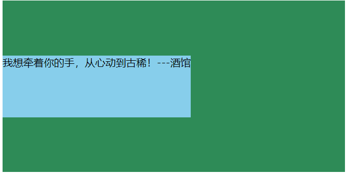
那么**不定高**的话：只能用`transform: translateY(-50%);`
```angular2html
子元素:
  margin-top:设置位元素宽度的负一半
  或者：
  transform: translateY(-50%)
```
```angular2html
<!DOCTYPE html>
<html lang="en">
<head>
	<meta charset="UTF-8">
	<meta name="viewport" content="width=device-width, initial-scale=1.0">
	<meta http-equiv="X-UA-Compatible" content="ie=edge">
	<title>垂直居中：定位属性-不定高</title>
	<style>
		#father{
			width: 666px;
			height: 333px;
			background-color: seagreen;
			position: relative;
		}
		#son{
			background-color: skyblue;
			position: absolute;
			top: 50%;
			-webkit-transform: translateY(-50%);
			-moz-transform: translateY(-50%);
			-ms-transform: translateY(-50%);
			-o-transform: translateY(-50%);
			transform: translateY(-50%);
		}
	</style>
</head>

<body>
<div id="father">
	<div id="son">我想牵着你的手，从心动到古稀！---酒馆</div>
</div>
</body>
</html>
```
效果如下：

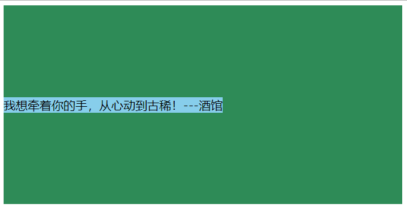
#### 方案二：flexbox布局实现（不论高度）
只需给块状元素的父元素设置`display: flex; align-items: center;`
```angular2html
<!DOCTYPE html>
<html lang="en">
<head>
	<meta charset="UTF-8">
	<meta name="viewport" content="width=device-width, initial-scale=1.0">
	<meta http-equiv="X-UA-Compatible" content="ie=edge">
	<title>垂直居中：flebox布局-不论高度</title>
	<style>
		#father{
			width: 666px;
			height: 333px;
			background-color: seagreen;

			display: flex;
			align-items: center;
		}
		#son{
			background-color: skyblue;
		}
	</style>
</head>

<body>
<div id="father">
	<div id="son">我想牵着你的手，从心动到古稀！---酒馆</div>
</div>
</body>
</html>
```
效果如下：

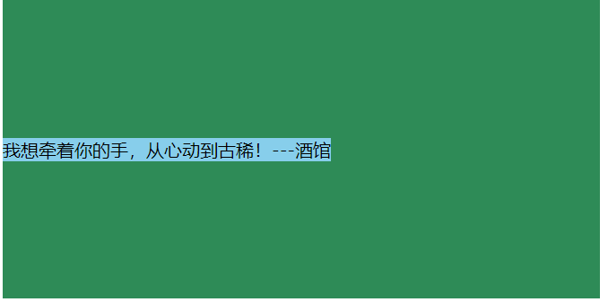
## 水平垂直居中
###已知高度和宽度的元素
#### 方案一：position+top/right/bottom/left
```angular2html
  父元素:相对定位
  子元素:绝对定位 + top: 0; right: 0; bottom: 0; left: 0; margin: auto;
```
```angular2html
<!DOCTYPE html>
<html lang="en">
<head>
	<meta charset="UTF-8">
	<meta name="viewport" content="width=device-width, initial-scale=1.0">
	<meta http-equiv="X-UA-Compatible" content="ie=edge">
	<title>水平垂直居中：宽高定<1></title>
	<style>
		#father{
			width: 666px;
			height: 333px;
			background-color: seagreen;
			
			position: relative;
		}
		#son{
			width: 200px;
			height: 111px;
			background-color: skyblue;
			
			position: absolute;
			top: 0;
			right: 0;
			bottom: 0;
			left: 0;
			margin: auto;
		}
	</style>
</head>
<body>
<div id="father">
	<div id="son">我想牵着你的手，从心动到古稀！--酒馆</div>
</div>
</body>
</html>
```
效果如下：

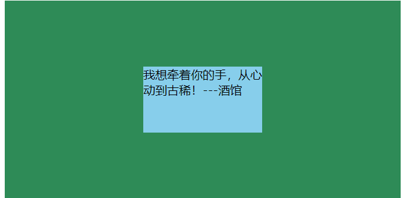

#### 方案二：position+margin
```angular2html
  父元素:相对定位
  子元素:绝对定位 + left: 50%; top: 50%; margin-left: 元素宽度的负一半; margin-top: 元素高度的负一半;
```
```angular2html
<!DOCTYPE html>
<html lang="en">

<head>
	<meta charset="UTF-8">
	<meta name="viewport" content="width=device-width, initial-scale=1.0">
	<meta http-equiv="X-UA-Compatible" content="ie=edge">
	<title>水平垂直居中：宽高定<2></title>
	<style>
		#father{
			width: 666px;
			height: 333px;
			background-color: seagreen;

			position: relative;
		}
		#son{
			width: 200px;
			height: 120px;
			background-color: skyblue;

			position: absolute;
			left: 50%;
			top: 50%;
			margin-left: -100px;
			margin-top: -60px;
		}
	</style>
</head>
<body>
<div id="father">
	<div id="son">我想牵着你的手，从心动到古稀！--酒馆</div>
</div>
</body>
</html>
```
效果如下：

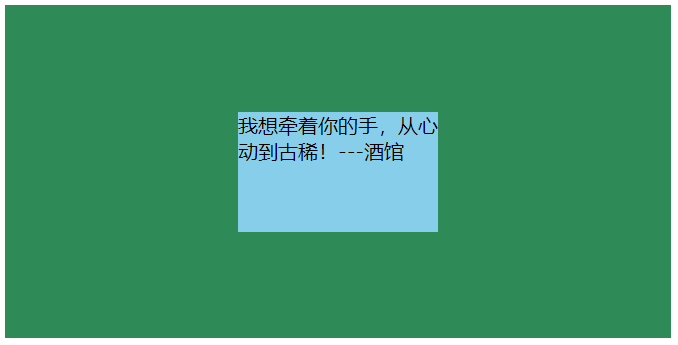
### 未知高度和宽度的元素
####方案一：使用定位属性
```angular2html
  父元素:相对定位
  子元素:绝对定位 + left: 50%; top: 50%; + transform: translateX(-50%) translateY(-50%);
```
```angular2html
<!DOCTYPE html>
<html lang="en">
<head>
	<meta charset="UTF-8">
	<meta name="viewport" content="width=device-width, initial-scale=1.0">
	<meta http-equiv="X-UA-Compatible" content="ie=edge">
	<title>水平垂直居中：宽高未知<1></title>
	<style>
		#father{
			width: 666px;
			height: 333px;
			background-color: seagreen;

			position: relative;
		}
		#son{
			background-color: skyblue;

			position: absolute;
			left: 50%;
			top: 50%;
			transform: translateX(-50%) translateY(-50%)
		}
	</style>
</head>
<body>
<div id="father">
	<div id="son">我想牵着你的手，从心动到古稀！</div>
</div>
</body>
</html>
```
效果如下：

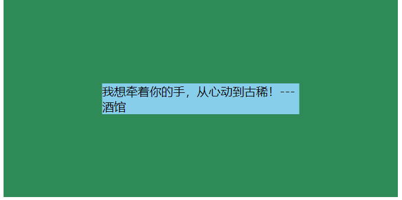
方案二：使用flex布局实现
```angular2html
  父元素:
    display:flex;
    justify-content: center; 
    align-items: center;
```
```angular2html
<!DOCTYPE html>
<html lang="en">
<head>
	<meta charset="UTF-8">
	<meta name="viewport" content="width=device-width, initial-scale=1.0">
	<meta http-equiv="X-UA-Compatible" content="ie=edge">
	<title>水平垂直居中：宽高未知<2></title>
	<style>
		#father{
			width: 666px;
			height: 333px;
			background-color: seagreen;

			display:flex;
			justify-content: center;
			align-items: center;
		}
		#son{
			background-color: skyblue;
		}
	</style>
</head>
<body>
<div id="father">
	<div id="son">我想牵着你的手，从心动到古稀！---酒馆</div>
</div>
</body>
</html>
```

效果如下：

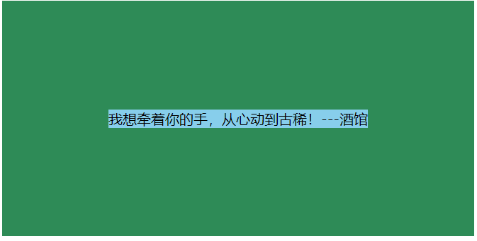
